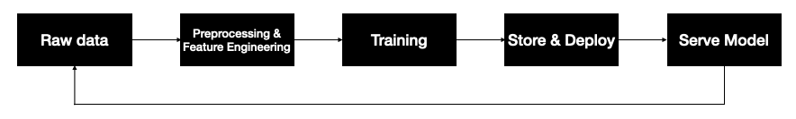

# machine learning serving




## Install
```
git clone 
cd machine_learning_serving
python3.8 -m venv venv
. venv/bin/activate
pip install -U pip
pip install -r requirements.txt
```

## MLflow


```
cd mlflow_tutorial
mlflow ui --backend-store-uri sqlite:///store.db

#Open new terminal
cd machine_learning_serving
. venv/bin/activate
cd mlflow_tutorial
python train.py 0.3 0.5

#open browser http://localhost:5000
```

   

## Airflow
```
. venv/bin/activate
cd airflow_tutorial
export AIRFLOW_HOME=$(pwd)/airflow
export PYTHONPATH=$(pwd):$PYTHONPATH
export OBJC_DISABLE_INITIALIZE_FORK_SAFETY=YES

mkdir airflow/dags
cp dags/ml_pipeline.py airflow/dags/ml_pipeline.py
airflow dags list

airflow db init
airflow users create \
    --username admin \
    --firstname Peter \
    --lastname Parker \
    --role Admin \
    --email spiderman@superhero.org


airflow webserver --port 8080
#open browser http://localhost:8080 and enable ml_pipeline

#Open new terminal
cd machine_learning_serving
. venv/bin/activate
cd airflow_tutorial
python serve.py

#Open new terminal
cd machine_learning_serving
. venv/bin/activate
cd airflow_tutorial
export AIRFLOW_HOME=$(pwd)/airflow
export PYTHONPATH=$(pwd):$PYTHONPATH
export OBJC_DISABLE_INITIALIZE_FORK_SAFETY=YES
airflow scheduler

```
# References
 - [https://speakerdeck.com/dongjin/introducing-mlflow](https://speakerdeck.com/dongjin/introducing-mlflow)
 - [https://towardsdatascience.com/setup-mlflow-in-production-d72aecde7fef](https://towardsdatascience.com/setup-mlflow-in-production-d72aecde7fef)
 - [https://towardsdatascience.com/10-minutes-to-building-a-machine-learning-pipeline-with-apache-airflow-53cd09268977](https://towardsdatascience.com/10-minutes-to-building-a-machine-learning-pipeline-with-apache-airflow-53cd09268977)